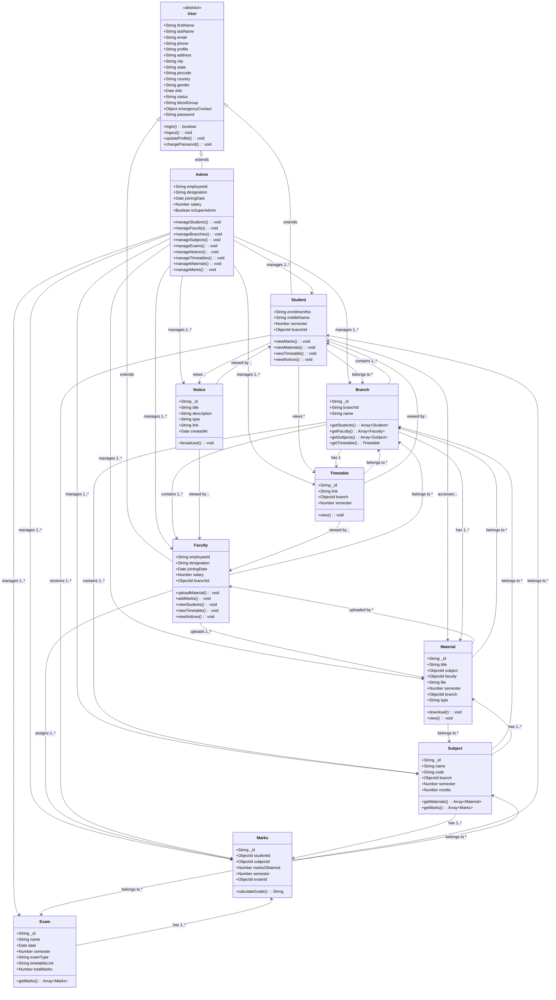

# College Management System - Enhanced Class Diagram

## UML Class Diagram



## Class Descriptions

### Core Classes

| Class | Type | Description | Key Attributes |
|-------|------|-------------|----------------|
| **User** | Abstract | Base class for all user types | firstName, lastName, email, phone, password |
| **Admin** | Concrete | System administrator with full access | employeeId, designation, isSuperAdmin |
| **Faculty** | Concrete | Teaching staff | employeeId, designation, branchId |
| **Student** | Concrete | Students enrolled in college | enrollmentNo, semester, branchId |

### Supporting Classes

| Class | Description | Key Attributes |
|-------|-------------|----------------|
| **Branch** | Academic departments | branchId, name |
| **Subject** | Course information | name, code, branch, semester, credits |
| **Exam** | Assessment details | name, date, examType, totalMarks |
| **Marks** | Student performance records | studentId, subjectId, marksObtained, examId |
| **Material** | Study resources | title, subject, faculty, file, type |
| **Notice** | Announcements | title, description, type, createdAt |
| **Timetable** | Schedule information | link, branch, semester |

## Relationship Types

### Inheritance
- **Admin**, **Faculty**, and **Student** inherit from **User**
- All user types share common authentication and profile management methods

### Associations
- **Composition**: Branch contains Students, Faculty, Subjects
- **Aggregation**: Admin manages all entities (loose coupling)
- **Dependency**: Users depend on various services (Materials, Notices, etc.)

### Multiplicities
- **1**: Exactly one (e.g., Student belongs to one Branch)
- **1..***: One or more (e.g., Branch has multiple Students)
- ****..*****: Many to many (e.g., Students access multiple Materials)

## Key Design Patterns

### 1. Inheritance Hierarchy
```
User (Abstract)
├── Admin (Full System Access)
├── Faculty (Teaching & Assessment)
└── Student (Learning & Information Access)
```

### 2. Role-Based Access Control
- Each user type has specific permissions
- Admin: CRUD on all entities
- Faculty: Upload materials, manage marks
- Student: Read-only access to academic data

### 3. Repository Pattern
- Each entity has dedicated data access methods
- Centralized data management through models
- Consistent CRUD operations across entities

## Class Responsibilities

### User Classes
- **Authentication**: Login/logout functionality
- **Profile Management**: Update personal information
- **Security**: Password management

### Admin Class
- **System Administration**: Full entity management
- **User Management**: Create, update, delete users
- **Content Management**: Oversee all system content

### Faculty Class
- **Teaching**: Upload study materials
- **Assessment**: Enter and update student marks
- **Information Access**: View student details and schedules

### Student Class
- **Learning**: Access study materials and marks
- **Information**: View notices and timetables
- **Academic Tracking**: Monitor performance

### Supporting Classes
- **Data Storage**: Represent database entities
- **Business Logic**: Implement domain-specific operations
- **Relationships**: Maintain referential integrity