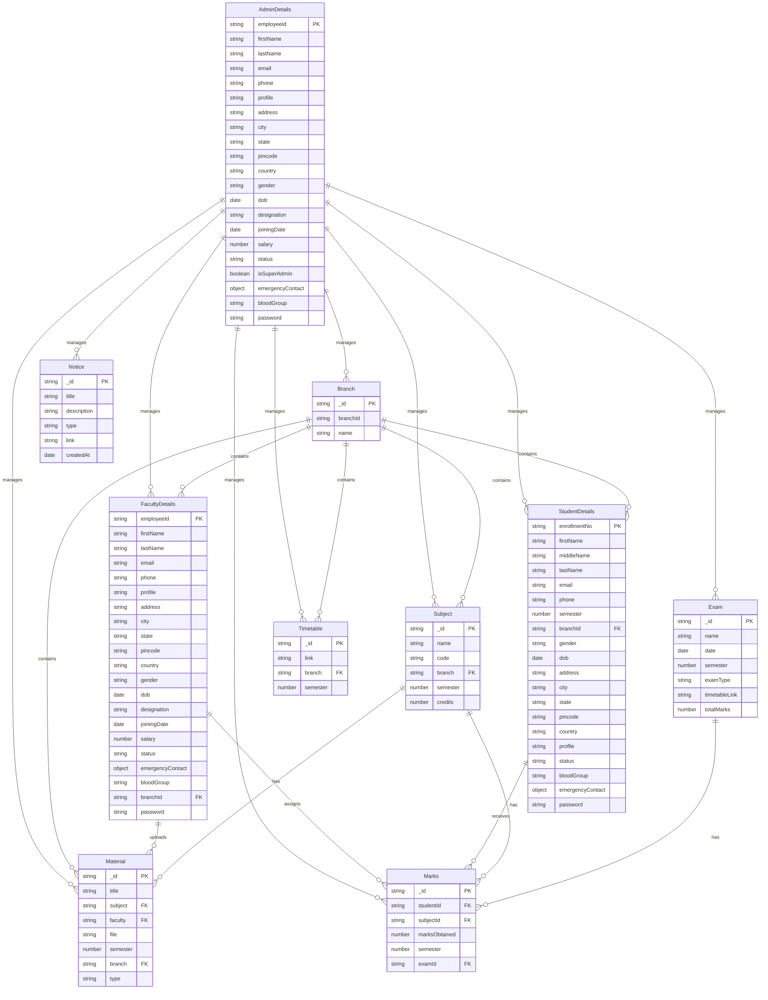

# College Management System - Enhanced ER Diagram

## Entity-Relationship Diagram

## Entity Descriptions

### Core User Entities
| Entity | Primary Key | Key Attributes | Relationships |
|--------|-------------|----------------|---------------|
| **AdminDetails** | employeeId | firstName, lastName, email, designation | Manages all entities |
| **FacultyDetails** | employeeId | firstName, lastName, email, branchId | Belongs to Branch, uploads Material, assigns Marks |
| **StudentDetails** | enrollmentNo | firstName, lastName, email, branchId, semester | Belongs to Branch, receives Marks |

### Academic Entities
| Entity | Primary Key | Key Attributes | Relationships |
|--------|-------------|----------------|---------------|
| **Branch** | _id | branchId, name | Contains Faculty, Students, Subjects |
| **Subject** | _id | name, code, branch, semester, credits | Belongs to Branch, has Materials and Marks |
| **Exam** | _id | name, date, semester, examType, totalMarks | Has Marks |

### Content Entities
| Entity | Primary Key | Key Attributes | Relationships |
|--------|-------------|----------------|---------------|
| **Material** | _id | title, subject, faculty, file, type | Belongs to Subject, Faculty, Branch |
| **Notice** | _id | title, description, type, createdAt | Broadcasts to users |
| **Timetable** | _id | link, branch, semester | Belongs to Branch |

### Assessment Entity
| Entity | Primary Key | Key Attributes | Relationships |
|--------|-------------|----------------|---------------|
| **Marks** | _id | studentId, subjectId, marksObtained, examId | Belongs to Student, Subject, Exam |

## Cardinality Legend
- **||--o{** : One to Many (1:N)
- **||--||** : One to One (1:1)
- **}o--o{** : Many to Many (N:M)

## Key Business Rules
1. Each Faculty belongs to exactly one Branch
2. Each Student belongs to exactly one Branch
3. Subjects are offered by specific Branches and semesters
4. Materials are uploaded by Faculty for specific Subjects
5. Marks are recorded for Student-Subject-Exam combinations
6. Notices can target Students, Faculty, or both
7. Timetables are specific to Branch and semester