# College Management System - Enhanced Use Case Diagram

## UML Use Case Diagram

```mermaid
graph TD
    subgraph "College Management System"
        subgraph "Admin Use Cases"
            A1[Login to System]
            A2[Logout from System]
            A3[View Profile]
            A4[Update Profile]
            A5[Change Password]

            A6[Add Student]
            A7[View Students]
            A8[Update Student Details]
            A9[Delete Student]
            A10[Activate/Deactivate Student]

            A11[Add Faculty]
            A12[View Faculty]
            A13[Update Faculty Details]
            A14[Delete Faculty]
            A15[Activate/Deactivate Faculty]

            A16[Add Branch]
            A17[View Branches]
            A18[Update Branch]
            A19[Delete Branch]

            A20[Add Subject]
            A21[View Subjects]
            A22[Update Subject]
            A23[Delete Subject]

            A24[Create Exam]
            A25[View Exams]
            A26[Update Exam Details]
            A27[Delete Exam]

            A28[Create Notice]
            A29[View Notices]
            A30[Update Notice]
            A31[Delete Notice]

            A32[Upload Timetable]
            A33[View Timetables]
            A34[Update Timetable]
            A35[Delete Timetable]

            A36[View All Materials]
            A37[Delete Material]

            A38[View All Marks]
            A39[Update Marks]
        end

        subgraph "Faculty Use Cases"
            F1[Login to System]
            F2[Logout from System]
            F3[View Profile]
            F4[Update Profile]
            F5[Change Password]

            F6[Upload Material]
            F7[View Uploaded Materials]
            F8[Update Material]
            F9[Delete Material]

            F10[Add Marks]
            F11[View Marks]
            F12[Update Marks]

            F13[View Timetable]
            F14[View Notices]
            F15[Search Students]
            F16[View Student Details]
            F17[View Exams]
        end

        subgraph "Student Use Cases"
            S1[Login to System]
            S2[Logout from System]
            S3[View Profile]
            S4[Update Profile]
            S5[Change Password]

            S6[View Marks]
            S7[View Materials]
            S8[Download Materials]

            S9[View Timetable]
            S10[View Notices]
            S11[View Exams]
        end
    end

    subgraph "Actors"
        Admin[Admin<br/>System Administrator]
        Faculty[Faculty<br/>Teaching Staff]
        Student[Student<br/>College Student]
    end

    %% Admin connections
    Admin --> A1
    Admin --> A2
    Admin --> A3
    Admin --> A4
    Admin --> A5
    Admin --> A6
    Admin --> A7
    Admin --> A8
    Admin --> A9
    Admin --> A10
    Admin --> A11
    Admin --> A12
    Admin --> A13
    Admin --> A14
    Admin --> A15
    Admin --> A16
    Admin --> A17
    Admin --> A18
    Admin --> A19
    Admin --> A20
    Admin --> A21
    Admin --> A22
    Admin --> A23
    Admin --> A24
    Admin --> A25
    Admin --> A26
    Admin --> A27
    Admin --> A28
    Admin --> A29
    Admin --> A30
    Admin --> A31
    Admin --> A32
    Admin --> A33
    Admin --> A34
    Admin --> A35
    Admin --> A36
    Admin --> A37
    Admin --> A38
    Admin --> A39

    %% Faculty connections
    Faculty --> F1
    Faculty --> F2
    Faculty --> F3
    Faculty --> F4
    Faculty --> F5
    Faculty --> F6
    Faculty --> F7
    Faculty --> F8
    Faculty --> F9
    Faculty --> F10
    Faculty --> F11
    Faculty --> F12
    Faculty --> F13
    Faculty --> F14
    Faculty --> F15
    Faculty --> F16
    Faculty --> F17

    %% Student connections
    Student --> S1
    Student --> S2
    Student --> S3
    Student --> S4
    Student --> S5
    Student --> S6
    Student --> S7
    Student --> S8
    Student --> S9
    Student --> S10
    Student --> S11
```

## Use Case Categories

### 🔐 Authentication & Profile Management
| Use Case | Actor | Description |
|----------|-------|-------------|
| Login to System | All Users | Authenticate and access the system |
| Logout from System | All Users | Securely exit the system |
| View Profile | All Users | Display personal information |
| Update Profile | All Users | Modify personal details |
| Change Password | All Users | Update account password |

### 👥 User Management (Admin Only)
| Use Case | Description |
|----------|-------------|
| Add Student/Faculty | Create new user accounts |
| View Students/Faculty | Display user lists |
| Update Student/Faculty Details | Modify user information |
| Delete Student/Faculty | Remove user accounts |
| Activate/Deactivate Student/Faculty | Control account status |

### 🏫 Academic Management (Admin Only)
| Use Case | Description |
|----------|-------------|
| Add Branch/Subject | Create academic entities |
| View Branches/Subjects | Display academic structures |
| Update Branch/Subject | Modify academic information |
| Delete Branch/Subject | Remove academic entities |

### 📝 Assessment Management
| Use Case | Actor | Description |
|----------|-------|-------------|
| Create Exam | Admin | Schedule examinations |
| View Exams | All Users | Display exam information |
| Update Exam Details | Admin | Modify exam information |
| Delete Exam | Admin | Remove exam records |
| Add Marks | Faculty | Enter student marks |
| View Marks | All Users | Display marks/grades |
| Update Marks | Admin/Faculty | Modify marks |

### 📚 Content Management
| Use Case | Actor | Description |
|----------|-------|-------------|
| Upload Material | Faculty | Add study materials |
| View Materials | All Users | Access study resources |
| Download Materials | Student | Download files |
| Update Material | Faculty | Modify materials |
| Delete Material | Faculty | Remove materials |
| View All Materials | Admin | Admin oversight |

### 📢 Communication & Scheduling
| Use Case | Actor | Description |
|----------|-------|-------------|
| Create Notice | Admin | Post announcements |
| View Notices | All Users | Read announcements |
| Update Notice | Admin | Modify announcements |
| Delete Notice | Admin | Remove announcements |
| Upload Timetable | Admin | Add schedule information |
| View Timetables | All Users | Access schedules |
| Update Timetable | Admin | Modify schedules |
| Delete Timetable | Admin | Remove schedules |

### 🔍 Information Access
| Use Case | Actor | Description |
|----------|-------|-------------|
| Search Students | Faculty | Find student information |
| View Student Details | Faculty | Access student profiles |

## Detailed Use Case Specifications

### Primary Actor: Admin

#### Use Case: Login to System
- **Description:** Admin authenticates to access the system
- **Preconditions:** Admin has valid credentials
- **Main Flow:**
  1. Admin navigates to login page
  2. Enters employee ID and password
  3. System validates credentials
  4. Admin is redirected to dashboard
- **Postconditions:** Admin has full system access
- **Alternative Flows:** Invalid credentials → Error message

#### Use Case: Add Student
- **Description:** Admin creates new student account
- **Preconditions:** Admin is logged in
- **Main Flow:**
  1. Admin selects "Add Student"
  2. Enters student details (enrollment, name, branch, etc.)
  3. System validates input
  4. Student account is created
- **Postconditions:** Student can login to system

### Primary Actor: Faculty

#### Use Case: Upload Material
- **Description:** Faculty adds study materials for students
- **Preconditions:** Faculty is logged in
- **Main Flow:**
  1. Faculty selects "Upload Material"
  2. Chooses subject, material type, and file
  3. Uploads file to system
  4. System stores material with metadata
- **Postconditions:** Material is available to relevant students

#### Use Case: Add Marks
- **Description:** Faculty enters student assessment results
- **Preconditions:** Faculty is logged in, exam exists
- **Main Flow:**
  1. Faculty selects exam and student
  2. Enters marks obtained
  3. System validates marks range
  4. Marks are saved and associated with student/exam
- **Postconditions:** Student can view their marks

### Primary Actor: Student

#### Use Case: View Marks
- **Description:** Student checks their academic performance
- **Preconditions:** Student is logged in
- **Main Flow:**
  1. Student selects "View Marks"
  2. System retrieves marks for the student
  3. Marks are displayed by subject and exam
- **Postconditions:** Student can see their grades

#### Use Case: Download Materials
- **Description:** Student downloads study resources
- **Preconditions:** Student is logged in, materials exist
- **Main Flow:**
  1. Student browses available materials
  2. Selects material to download
  3. System provides download link
  4. File is downloaded to device
- **Postconditions:** Student has local copy of material

## System Boundaries & Interfaces

### External Systems
- **Email Service:** For notifications and password resets
- **File Storage:** For material uploads and downloads
- **Authentication Service:** JWT token management

### System Components
- **Web Interface:** React.js frontend
- **API Layer:** Express.js backend
- **Database:** MongoDB with Mongoose
- **File System:** Local/cloud storage for materials

### Security Boundaries
- **Authentication:** Login/logout mechanisms
- **Authorization:** Role-based access control
- **Data Validation:** Input sanitization and validation
- **File Security:** Upload restrictions and access control

## Business Rules & Constraints

### User Management Rules
1. Each user must have unique identifier (employee ID/enrollment number)
2. Passwords must meet complexity requirements
3. Admin accounts cannot be deactivated by other admins
4. Students can only view their own information

### Academic Rules
1. Subjects belong to specific branches and semesters
2. Exams are scheduled for specific semesters
3. Marks must be within valid range (0 to total marks)
4. Materials are accessible based on branch and semester

### Content Rules
1. Notices can target specific user groups
2. Timetables are branch and semester specific
3. Materials are uploaded by authorized faculty only
4. File types and sizes have restrictions

## Performance Requirements
- System should handle 1000+ concurrent users
- File uploads should complete within 30 seconds
- Search operations should return results within 2 seconds
- Reports should generate within 10 seconds